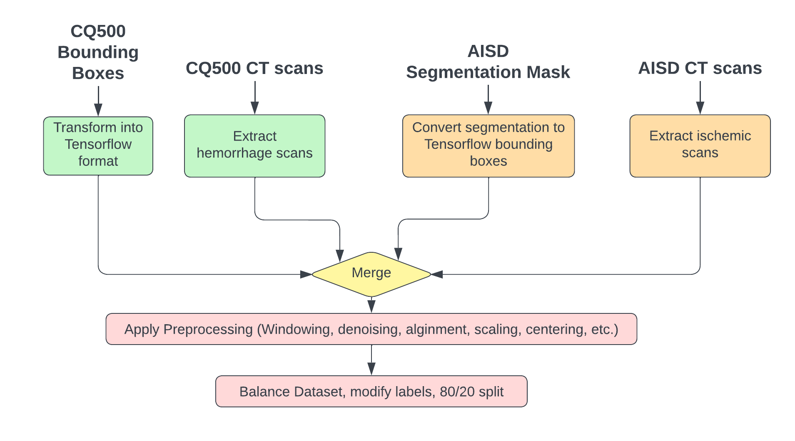

# Stroke Detection

This repo contains the code that started the implementation of a stroke detection model. It uses the CQ500 and AISD dataset to create a joint dataset with bounding box annotations for stroke regions. You'll first have to download the datasets including the annotations in order to run the notebooks. The basic principle is that first a script extracts the important files such as dicom scans and masks from the raw dataset folder and copies them into this projects data directory. Then further preprocessing is performed to transform it into the right format for training an object detection model.

### Download Links
AISD: https://github.com/GriffinLiang/AISD \
CQ500: http://headctstudy.qure.ai/dataset \
CQ500 Bounding Boxes (qureai-cq500-boxes-updated.csv): https://www.kaggle.com/c/rsna-intracranial-hemorrhage-detection/discussion/113339 

### Preprocessing Pipeline
Note: This is a rough sketch of the preprocessing pipeline and it is not entirely implemented. We were experimenting with training object detection models in Tensorflow so we still need to make some adjustments in order to use a joint dataset for training.

